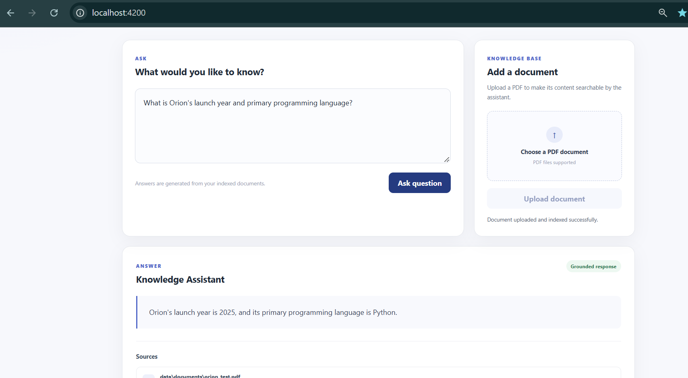

# AI Knowledge Assistant

A full-stack document Q&A application built with Angular, Spring Boot, FastAPI, and Retrieval-Augmented Generation (RAG).

Users can upload PDF documents and ask questions about their content. The application retrieves relevant sections from the indexed documents and uses them as context to generate grounded answers with source information.

## Application




## Architecture

```text
                        Angular
                     Frontend :4200
                      /          \
                     /            \
                Questions       PDF Upload
                    |               |
                    v               v
              Spring Boot        FastAPI
              Backend :8080      :8000
                    |               |
                    v               |
                 FastAPI            |
                    |               |
                    +-------+-------+
                            |
                            v
                    Document Processing
                            |
                   Chunking + Embeddings
                            |
                            v
                         Chroma
                            |
                            v
                    Semantic Retrieval
                            |
                            v
                     Relevant Context
                            |
                            v
                           LLM
                            |
                            v
                    Answer + Sources
```

The Spring Boot service acts as the application backend for question requests, while document ingestion is handled by the FastAPI AI service.

## Tech Stack

**Frontend**
- Angular
- TypeScript
- HTML/CSS

**Backend**
- Java 17
- Spring Boot
- Spring Web MVC
- Maven

**AI Service**
- Python
- FastAPI
- LangChain
- OpenAI
- Chroma
- PyPDF

## RAG Pipeline

### Document ingestion

Uploaded PDFs are loaded and split into smaller overlapping chunks using `RecursiveCharacterTextSplitter`.

```text
Chunk size: 1000
Chunk overlap: 200
```

### Embeddings

Document chunks are converted into vector embeddings using:

```text
text-embedding-3-small
```

The embeddings and document metadata are stored locally in Chroma.

### Retrieval

For each question, the query is embedded and compared against the indexed document chunks. The most relevant chunks are retrieved using similarity search.

The current implementation retrieves the top 3 matching chunks.

### Answer generation

Retrieved chunks are passed to the language model as context along with the user's question.

The prompt restricts the model to the retrieved context. If the requested information is not available in the documents, the application returns a fallback response instead of generating an unsupported answer.

Source document and page metadata from the retrieved chunks are returned with the answer.

## Project Structure

```text
ai-knowledge-assistant/
│
├── frontend/                  # Angular application
│
├── backend/                   # Spring Boot backend
│
├── ai-service/
│   ├── app/
│   │   ├── embeddings/
│   │   ├── generation/
│   │   ├── ingestion/
│   │   ├── retrieval/
│   │   ├── schemas/
│   │   ├── vectorstore/
│   │   └── main.py
│   │
│   └── requirements.txt
│
├── .gitignore
└── README.md
```

## API

### Spring Boot

```text
GET  /api/health
POST /api/query
```

Example query:

```json
{
  "query": "Where is NovaTech headquartered?"
}
```

### FastAPI

```text
GET  /health
POST /query
POST /documents/upload
```

Example response:

```json
{
  "answer": "NovaTech is headquartered in Bengaluru, India.",
  "sources": [
    {
      "source": "data/documents/rag_test_dataset.pdf",
      "page": "1"
    }
  ]
}
```

FastAPI Swagger documentation is available locally at:

```text
http://localhost:8000/docs
```

## Running Locally

### AI service

```powershell
cd ai-service

python -m venv venv
.\venv\Scripts\Activate.ps1

pip install -r requirements.txt
```

Create an `.env` file inside `ai-service`:

```text
OPENAI_API_KEY=your_api_key
```

Start the service:

```powershell
uvicorn app.main:app --port 8000
```

### Spring Boot

```powershell
cd backend
.\mvnw.cmd spring-boot:run
```

### Angular

```powershell
cd frontend
npm install
npx ng serve
```

Open:

```text
http://localhost:4200
```

## Current Scope

The current version supports:

- PDF upload and indexing
- Recursive document chunking
- OpenAI embeddings
- Chroma vector storage
- Semantic similarity retrieval
- Context-grounded question answering
- Source document and page metadata
- Angular-based document upload and Q&A interface

The application currently uses local vector storage and does not include authentication or document lifecycle management.

## Possible Improvements

- Duplicate document detection
- Document deletion and re-indexing
- Metadata filtering
- Hybrid search
- Reranking
- Conversation history
- RAG evaluation
- Authentication
- Containerization and cloud deployment

## Author

**Jyothi S Ragate**

Software Engineer  
Angular · TypeScript · Java · Spring Boot · Python · FastAPI · RAG
